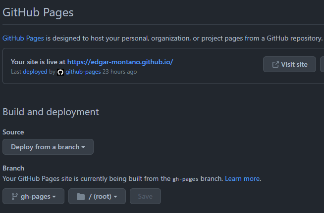

# Getting Started

This project was bootstrapped with [Create React App](https://github.com/facebook/create-react-app) and utilizes [TailWindCSS](https://tailwindcss.com).

**Note: You do not need advance programming knowledge to use this template! All you need is [Node.js](https://nodejs.org/en/download/) installed. and a decent code editor.**

## Installation

1. Either click the **Use This Template** button located in the top corner of the page, fork this repository, or simply clone the repository locally using:
   `git clone https://github.com/edgar-montano/react-tailwind-portfolio-template.git`

2. Afterwards simply run `npm install` to install all dependencies.

3. Modify `config.js` with your own information.

4. Deploy by running `npm run deploy`.

## Available Scripts

In the project directory, you can run:

### `npm start`

Runs the app in the development mode.\
Open [http://localhost:3000](http://localhost:3000) to view it in your browser.

The page will reload when you make changes.\
You may also see any lint errors in the console.

### `npm run deploy`

Builds the app for production to the `build` folder.\
It correctly bundles React in production mode and optimizes the build for the best performance.

The build is minified and the filenames include the hashes.\

Before the deployment is executed, the `predeploy` script will first run. The idea here is we first build our website, and then we deploy it to Github Pages.

# Live Demo

This project is bundled and optimized to be hosted on Github Pages directly. This means no need to pay for expensive hosting plans for your simple SPA app.

Live demo is available [here](https://edgar-montano.github.io).

# Configuration

This project is a single-page application with a single-entry point for all personal data. You can control the entirety of the website by modifying a single file, the `config.js` file.

## `config.js`

This file is split into two different exports, `sidebar` and `config`. The two exports operate independently of each other.

### `export const config`

This is a majority of the website's metadata. You can easily edit aspects of the website by simply modifying this singular object.

```javascript
export const config = {
  name: 'Edgar Montano',
  image: 'src/assets/avatar.jpg',
  description:
    'Degreed Computer Scientist with 5+ years of experience in programming, collaboration, critical thinking, problem solving, and project management. Specialty in Full Stack Web Development and Large Scale Web Applications. ',
  source: '',
  employment_status: true,
  typewriter_text: [
    "> I'm a Software Engineer.",
    "> I'm a Backend Engineer.",
    "> I'm a Data Scientist. ",
    "> I'm a Full Stack Dev.",
    "> I'm an Audio Engineer.",
    "> I'm a Hacker.",
    "> I'm a Linux User.",
  ],
}
```

### Full `config.js` with expected values

```typescript
export const config = {
  name: string,
  image: string,
  description: string,
  source: string,
  employment_status: boolean,
  typewriter_text: string[],
  contacts: [
    {
      name: string,
      url: string,
    },
  ],
  skills: [
    {
      name: string,
      level: string || boolean,
      libraries: string[],
    },
  ],
};
```

## Full `sidebar` with expected values

Initially this project used a JSON object, but was refactored into a native JS module for the opportunity to allow customized Icons to be dynamically imported.

Here we utilize the `react-icons` library for some dynamic buttons used for the side bar.
If you want to use your own components or different icons you can switch the library field and import the module you want directly into the file.

```javascript
// importing react-icons
import { FaLinkedin, FaGithub } from 'react-icons/fa'
import { HiOutlineMail } from 'react-icons/hi'

export const sidebar = [
  {
    name: 'LinkedIn',
    library: <FaLinkedin size={30} />, //using icon directly
    url: 'https://linkedin.com/in/edgar-montano',
  },
  {
    name: 'Github',
    library: <FaGithub size={30} />,
    url: 'https://github.com/edgar-montano',
  },
  {
    name: 'Email',
    library: <HiOutlineMail size={30} />,
    url: 'mailto:edgar@edgar-montano.com',
  },
]
```

# Deploying to Github Pages

Before deploying our project, we must do a few preliminary steps on Github to ensure our project will be properly deployed and hosted on Github Pages.

## 1. Create an empty repository on Github

It is important that your project site follows this naming convention carefully. The repository name for your project should be in the format of `{username}.github.io`

_For example in my case my repository name would be `edgar-montano.github.io` since my username on Github is `edgar-montano`._

If you used the **Use this template** button on Github, then you can simply rename your repository name to reflect this requirement. This can be done by navigating into your repository's setting and changing the name of the repository.

## 2. Push code to Github

After you create the repository make sure you push the code to the empty repository. This is done automatically when you utilize the template option, but if you did this manually then the step would look something like this:
`git remote add origin https://github.com/{username}/{repo-name}.git`

## 3. Modify `package.json`

Locate the `homepage` argument and replace the URL with your own project page URL or username for github.

```json
{
  "name": "react-tailwind-portfolio",
  "version": "0.1.0",
  "private": true,
  "homepage": "https://username.github.io" // modify this
}
```

## 4. Run `npm run deploy` script

This script will automatically run `predeploy` first, which will bundle your project for production.

This will create a new branch and folder. You should now see a build folder located in the root directory of your project. This is where your bundled website will be. You can use these files and host it directly on a static server, or you can use Github Pages to host your project.

## 5. Modify build and deployment settings

Navigate to your project settings > pages and set the "Branch" field to deploy from `gh-pages`. Now anytime you run `npm run deploy` it will automatically upload your project to Github Pages.



## Deployment Details

For a detailed explanation for deployment you can refer to the [documentation for gh-pages](https://github.com/gitname/react-gh-pages)
